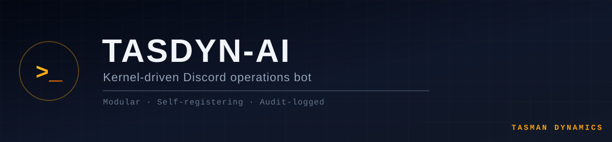

<div align="center">



[](https://nodejs.org/)
[](https://www.typescriptlang.org/)
[](https://discord.js.org/)
[](#️-status)
[](https://discord.gg/Wt4ahmxVrs)

</div>

---

**A Tasman Dynamics Systems Project**

TasDyn-AI (internally `sovereign-bot-os`) is the operations bot for the Tasman Dynamics Discord —
built as a self-contained OS kernel rather than a pile of ad-hoc command handlers. A small Kernel
boots storage, mounts self-describing modules, and routes every interaction through a single
Interaction Interrupt Controller. Modules are dropped into `modules/` and auto-discovered — no
other file needs to change to add one.

---

## 🧠 Architecture

<table>
<tr>
<td width="33%" valign="top">

### 🔩 Kernel Boot
`Kernel.boot()` runs a fixed sequence — **Storage → Modules → Network → Ready** — mounting SQLite,
then every module's commands/events/interactions, before authenticating with Discord.

</td>
<td width="33%" valign="top">

### 📡 IRQ Dispatcher
A single `InteractionCreate` listener (the "Interaction Interrupt Controller") routes every
button, modal, and slash command to the handler declared by the owning module.

</td>
<td width="33%" valign="top">

### 🔌 Self-Registering Modules
`moduleLoader.ts` scans `modules/*/index.ts` for a default-exported `ModuleConfig` at boot. Drop
a folder in, and the Kernel discovers, logs, and mounts it automatically.

</td>
</tr>
</table>

*A module never talks to the Kernel directly — it just describes itself (`name`, `description`,
`commands`, `events`, `onReady`, `interactions`) and the Kernel does the wiring.*

## 🧩 Modules

| Module | What it does |
|---|---|
| 🗣️ **broadcast** | Operator dispatch to any guild channel via modal |
| 🐙 **github** | Polls the GitHub org for new commits and posts them to `dev-logs` on a 5-minute heartbeat |
| 🛂 **iam** | Identity & Access Management — member lifecycle events, security gate deployment, moderation actions |
| 📦 **steamwatch** | Polls Steam Workshop for mod-page updates and posts changelogs to the releases channel |
| 🎫 **tickets** | Support ticket system — channel creation, management, and closure |

## 🪵 Audit Logging

Every module reports through `Syslog`, a Winston-backed logger with daily-rotating files under
`audit_logs/`. Log entries carry a `category` (`SYSTEM`, `AUTH`, `TICKET`, `MOD`, …), an `action`,
and a `severity`, and are routed to the matching Discord channel per `Config.log_routing` — so
moderation actions land in the audit channel, tickets in the ticket log, and so on. Once the bot
is ready, terminal `console` output is also mirrored into Discord.

## 🧰 Development

### Prerequisites
* Node.js 22+
* A Discord application/bot token, and the guild/channel/role IDs listed below

### Setup

```bash
npm install

# Create a .env file (never committed — see .gitignore) with the variables below
npm run dev      # tsx watch core/bot.ts — hot-reloading dev runner
npm run start     # tsx core/bot.ts — production entrypoint
npm run typecheck # tsc --noEmit
```

Slash commands are registered separately from the bot process, since `core/deploy.ts` reads the
same auto-discovered module list and pushes commands straight to the Discord API:

```bash
npx tsx core/deploy.ts
```

### ⚙️ Configuration

All configuration is validated at boot via a Zod schema (`core/config.ts`) — the process exits
immediately with a clear error if anything required is missing.

| Variable group | Examples |
|---|---|
| Core credentials | `DISCORD_TOKEN`, `DISCORD_CLIENT_ID`, `DISCORD_GUILD_ID` |
| Channel routing | `DISCORD_CHANNEL_TASDYN_LOGS_ID`, `DISCORD_CHANNEL_AUDIT_ID`, `DISCORD_CHANNEL_REPORT_ID`, `DISCORD_CHANNEL_IAM_ID`, `DISCORD_CHANNEL_BROADCAST_ID`, `DISCORD_CHANNEL_TICKET_ID`, `DISCORD_CHANNEL_GATEKEEPER_ID`, `DISCORD_CHANNEL_SECURITYGATES_ID`, `DISCORD_CHANNEL_RELEASES_ID`, `DISCORD_CHANNEL_DEV_LOGS_ID`, `DISCORD_CHANNEL_MOD_UPDATES_ID` |
| Support hub | `DISCORD_CHANNEL_SUPPORT_ID`, `DISCORD_CATEGORY_SUPPORT_ID` |
| Roles | `DISCORD_ROLE_ROOT_ID`, `DISCORD_ROLE_OWNER_ID`, `DISCORD_ROLE_DEVELOPER_ID`, `DISCORD_ROLE_STAFF_ID`, `DISCORD_ROLE_COMMUNITY_ID` |
| Integrations | `GITHUB_TOKEN` (required), `API_WEATHER_TOKEN` / `API_DATABASE_URL` (optional) |

## 🐳 Deployment

Ships as a two-stage Docker image — the first stage compiles `better-sqlite3`'s native bindings,
the second copies the built `node_modules` into a slim `node:22-alpine` runtime image.

```bash
docker compose up -d --build
```

* Credentials load from a local `.env` file at runtime — never baked into the image.
* `db_data` and `audit_logs` are named volumes, so the SQLite database and rotating log files
  survive container rebuilds.
* Outbound-only — the bot makes no inbound connections, so no ports are published.

## 📂 Project Structure

```text
TasDyn-AI/
├── core/
│   ├── bot.ts           # Entrypoint — builds the module list and calls Kernel.boot()
│   ├── kernel.ts         # Boot sequence + IRQ interaction dispatcher
│   ├── moduleLoader.ts    # Auto-discovers modules/*/index.ts
│   ├── config.ts          # Zod-validated environment schema
│   ├── database.ts        # better-sqlite3 (WAL mode) connection + schema init
│   ├── syslog.ts           # Winston audit logger + Discord log routing
│   ├── deploy.ts            # Registers slash commands with the Discord API
│   └── types.ts              # ModuleConfig / CommandModule / InteractionHandler contracts
├── modules/
│   ├── broadcast/
│   ├── github/
│   ├── iam/
│   ├── steamwatch/
│   └── tickets/
├── audit_logs/            # Daily-rotating audit log files (Docker volume)
├── Dockerfile
├── docker-compose.yml
└── package.json
```

## 🗓️ Status

**Production.** TasDyn-AI runs live in the Tasman Dynamics Discord, handling member gatekeeping,
support tickets, operator broadcasts, GitHub commit alerts, and Steam Workshop update tracking for
the studio's Arma 3 releases.

## 📜 License

Internal Tasman Dynamics tooling — not currently released under a public license.

---

<div align="center">

Questions about the bot? [Join the Tasman Dynamics Discord](https://discord.gg/Wt4ahmxVrs).

</div>
